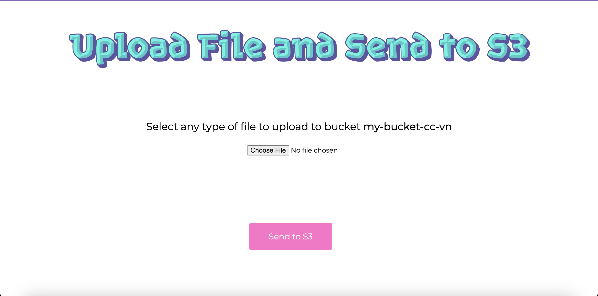
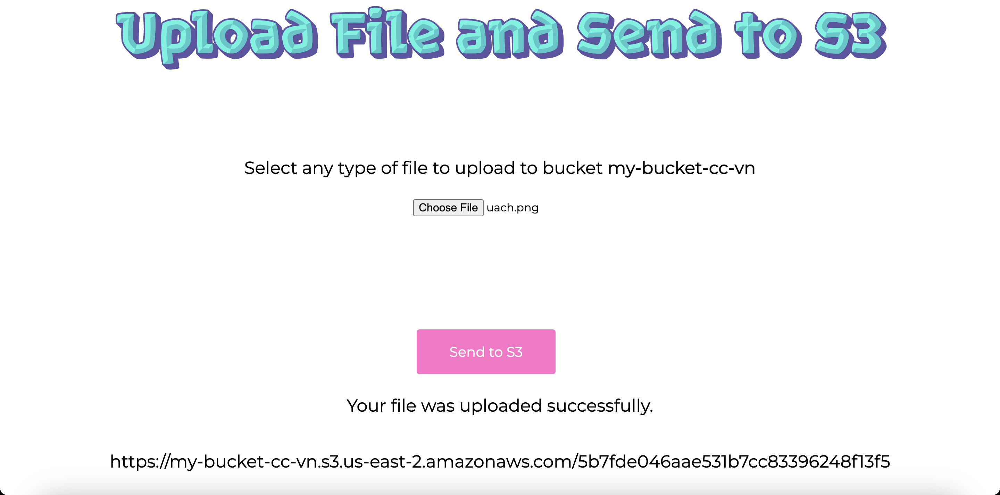
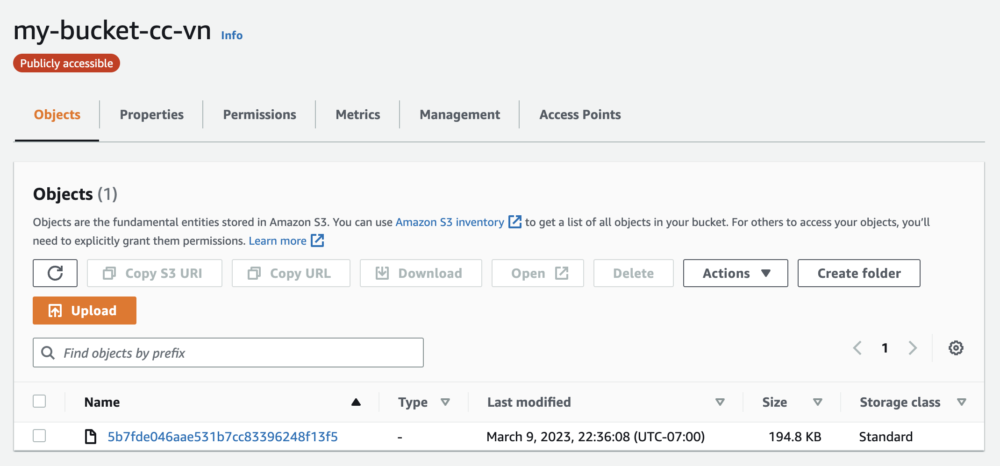
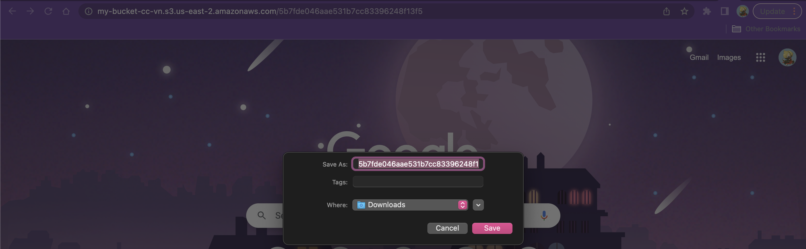

# Subir archivos desde una aplicación web

El propósito de esta aplicación es de poder subir cualquier tipo de archivo a un bucket de S3 de AWS. 

El bucket al que subiremos los archivos permite acceso público, y se llama **my-bucket-cc-vn**.Cuenta con los siguientes permisos:

```
{
    "Version": "2012-10-17",
    "Id": "Policy1678333757150",
    "Statement": [
        {
            "Sid": "Stmt1678333755682",
            "Effect": "Allow",
            "Principal": "*",
            "Action": "s3:GetObject",
            "Resource": "arn:aws:s3:::my-bucket-cc-vn/*"
        }
    ]
}
```

A su vez, se agregó una configuración CORS para poder utilizar el bucket en una aplicación web.

```
[
    {
        "AllowedHeaders": [
            "*"
        ],
        "AllowedMethods": [
            "PUT",
            "HEAD",
            "GET"
        ],
        "AllowedOrigins": [
            "*"
        ],
        "ExposeHeaders": []
    }
]
```
La interfaz sencilla de la aplicación web se muestra en la siguiente imagen:



A la hora de agregar un archivo a la aplicación y dar click en **Send to S3**, se manda un request al servidor para conectarse al bucket de S3 por medio de un access key y un secret key proporcionado por un IAM user **my-bucket-cc-vn-user** con un policy llamado **my-bucket-cc-vn-policy**:

```
{
    "Version": "2012-10-17",
    "Statement": [
        {
            "Sid": "VisualEditor0",
            "Effect": "Allow",
            "Action": "s3:PutObject",
            "Resource": "arn:aws:s3:::my-bucket-cc-vn/*"
        }
    ]
}
```
Cuando se da click en el botón **Send to S3**, el archivo se guarda en el bucket de S3 y se escribe un mensaje de confirmación al usuario de que su solicitud fue completada con éxito. 





Si copiamos el link generado por S3 en la aplicación web al momento de agregar el archivo, nos permite descargar dicho archivo.



## Cómo ejecutar la aplicación

Para poder utilizar la aplicación web, es necesario que el bucket de S3 exista y que tenga acceso público. También, el access key y la secret key deben estar activas. 

`Node.js` debe estar instalado localmente en la computadora.

Una vez clonado el repositorio, se utilizan los siguientes comandos:

```
npm install
node back/server.js
```

Para utilizar nodemon:
```
nodemon back/server.js
```

La aplicación web se mostrará en `localhost:8080`